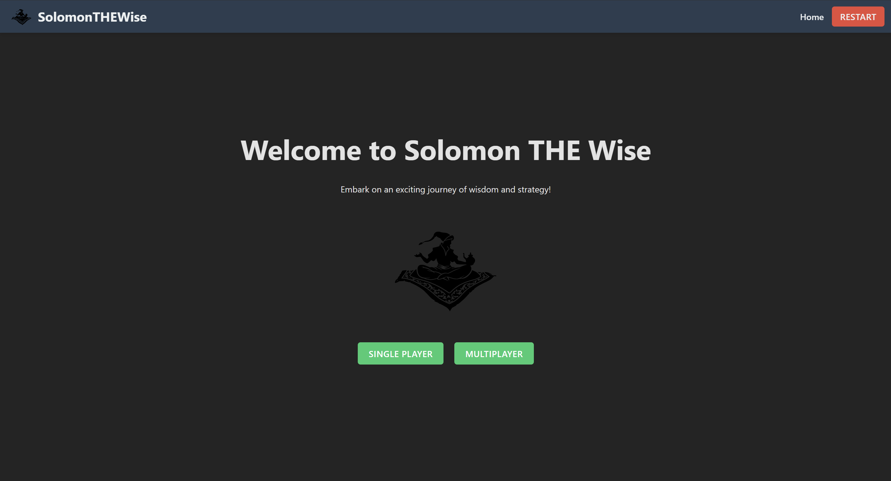
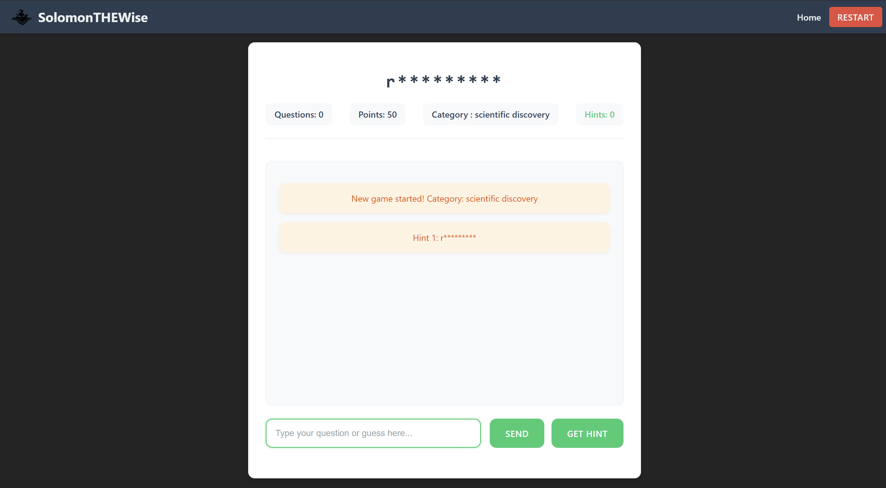

# 🎮 Solomon THE Wise

<p align="center">
  
</p>

<p align="center">
  A modern take on the classic 20 Questions game powered by AI
</p>

<p align="center">
  
  
  
</p>

## 🎯 Features

- 🎲 Single player mode with AI opponent
- 🏆 Dynamic scoring system
- 💭 Intelligent question answering
- 🎭 15 different categories
- 💡 Progressive hint system
- 🎨 Beautiful, responsive UI

## 🚀 Quick Start

1. Clone the repository:
```bash
git clone https://github.com/user-pratik/solomonTHEwise.git
cd solomonTHEwise
```

2. Install dependencies:
```bash
npm install
cd server
npm install
```

3. Set up environment variables:
Create a `.env` file in the server directory:
```env
PORT=3000
GEMINI_API_KEY=your_gemini_api_key
```

4. Start the development servers:
```bash
# Start backend server
cd server
npm start

# In a new terminal, start frontend
cd ..
npm run dev
```

## 🎮 How to Play

1. Choose a category or let the AI pick randomly
2. Ask yes/no questions to guess the word
3. Use hints strategically - each hint after the first one costs points
4. Make your guess when you're ready!

### 📝 Scoring System

- Start with 50 points
- Each question: -1 point
- Hint penalties:
  - First hint: Free
  - Second hint: -5 points
  - Third hint: -10 points
  - Fourth hint: -15 points

## 🎯 Categories

- Famous Person
- Company
- Animal
- Object
- Place
- Food
- Movie
- Book
- Sport
- Musical Instrument
- Historical Event
- Scientific Discovery
- Technology Brand
- Video Game
- TV Show

## 🖼️ Screenshots

<p align="center">
  
  
</p>

## 🛠️ Tech Stack

- Frontend:
  - React
  - Vite
  - Axios
  - React Router DOM

- Backend:
  - Node.js
  - Express
  - Google Gemini AI
  - CORS

## 📝 License

This project is proprietary software. All rights reserved.
No part of this software may be reproduced or used in any form without explicit permission from the author.

To request usage permission:
1. Open an issue on GitHub describing your intended use
2. Contact the author directly at [pratik.csdev@email.com]
3. Wait for explicit written permission before any use or modification

## 🤝 Usage Requests

Unlike open-source projects, this software requires explicit permission for:
- Commercial use
- Personal use
- Modification
- Distribution
- Private use

To request permission:
1. Fork this repository
2. Create an issue titled "Usage Permission Request"
3. Include in your request:
   - Intended use case
   - Project scope
   - Your contact information
   - Implementation timeline

The author will review requests on a case-by-case basis.

## 🤝 Contributing

Contributions are welcome! Please feel free to submit a Pull Request.

## 📞 Contact

Your Name - [@_Pratik_Anand](https://twitter.com/_Pratik_Anand)<br />
Email - pratik.csdev@gmail.com<br />
Project Link: [https://github.com/user-pratik/solomonTHEwise](https://github.com/user-pratik/solomonTHEwise](https://github.com/user-pratik/solomonTHEwise)
